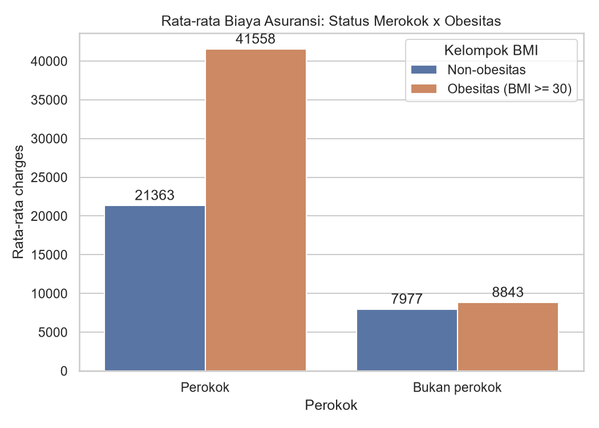
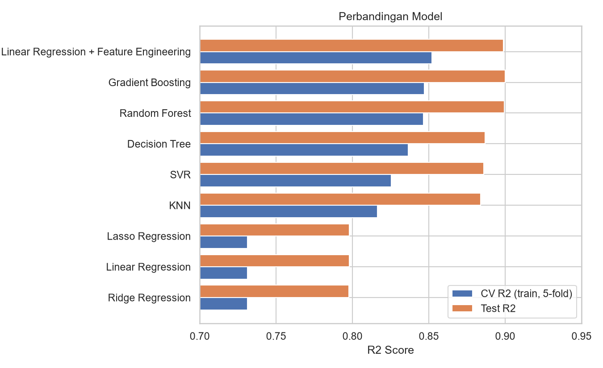
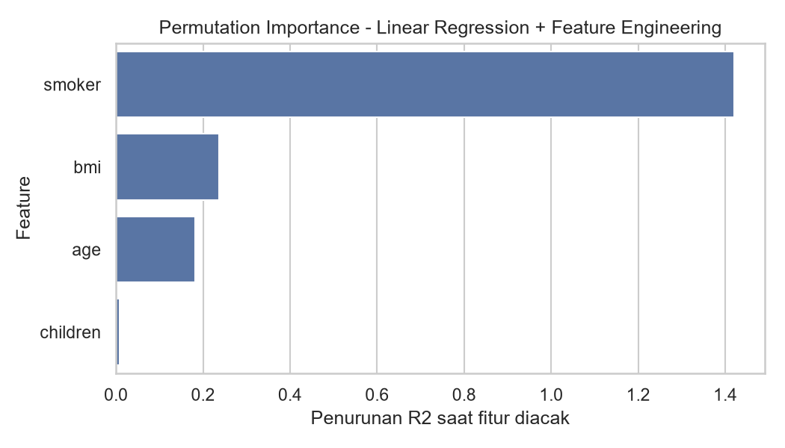
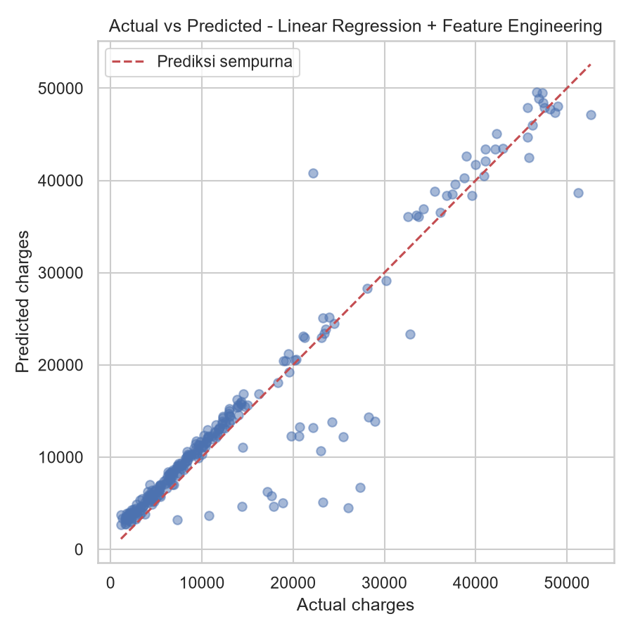

# Medical Insurance Cost Prediction

Project machine learning end-to-end untuk memprediksi **biaya asuransi kesehatan** (`charges`) dari data demografis dan gaya hidup. Project ini membandingkan 9 model regression, melakukan hyperparameter tuning dengan cross-validation, dan menyimpan model terbaik yang siap dipakai untuk prediksi.

## Ringkasan Hasil

- Model terbaik berdasarkan cross-validation: **Linear Regression + Feature Engineering** (CV R² 0,852; **Test R² 0,899**, MAE ≈ 2.284)
- Model berbasis tree (Gradient Boosting, Random Forest) mencapai performa yang setara (Test R² ≈ 0,90)
- **Linear Regression biasa hanya R² ≈ 0,80.** Gap ini ditutup dengan feature engineering sederhana, tanpa model yang lebih kompleks

## Dataset

[Medical Cost Personal Datasets](https://www.kaggle.com/datasets/mirichoi0218/insurance) di Kaggle (diunggah oleh pengguna Kaggle `mirichoi0218`), 1.338 baris tanpa missing value.

| Kolom | Keterangan |
|---|---|
| `age` | Usia |
| `sex` | Jenis kelamin |
| `bmi` | Body Mass Index |
| `children` | Jumlah tanggungan anak |
| `smoker` | Perokok atau bukan |
| `region` | Wilayah tempat tinggal |
| `charges` | **Target**: biaya asuransi |

File CSV tidak disertakan di repo ini. Download sendiri dari link di atas dan baca ketentuan lisensinya di halaman Kaggle.

## Temuan Utama (EDA)

**Status merokok adalah faktor dominan, dan efek obesitas hanya muncul pada perokok.**



| Kelompok | Rata-rata charges |
|---|---|
| Bukan perokok, non-obesitas | ~7.977 |
| Bukan perokok, obesitas | ~8.843 |
| Perokok, non-obesitas | ~21.363 |
| Perokok, obesitas | **~41.558** |

Obesitas nyaris tidak menaikkan biaya pada bukan perokok, tapi **menggandakannya** pada perokok. Pola "efek bergantung pada kombinasi fitur" ini tidak bisa ditangkap garis lurus, sehingga Linear Regression biasa kalah dari model tree.

Kolom `region` dan `sex` memiliki korelasi sangat lemah terhadap `charges` ([heatmap](outputs/figures/correlation_heatmap.png)) sehingga tidak dipakai sebagai fitur.

## Pendekatan

1. **Preprocessing**: drop `region` dan `sex`, encode `smoker` (no=0, yes=1), split 80/20 (`random_state=0`)
2. **Feature engineering untuk model linear** (`features.py`):
   - `obese` : BMI ≥ 30
   - `smoker_x_obese` : interaksi perokok × obesitas
   - `age2` : usia kuadrat
3. **Training 9 model**: Linear, Ridge, Lasso, Linear + Feature Engineering, Decision Tree, Random Forest, Gradient Boosting, KNN, SVR
4. **Tuning** dengan `GridSearchCV` (5-fold) untuk model yang punya hyperparameter penting
5. **Pemilihan model terbaik berdasarkan CV R² pada data train**, bukan pada data test, supaya data test tetap menjadi ukuran performa yang jujur

## Hasil Perbandingan Model

Diurutkan berdasarkan CV R² (kriteria pemilihan model).

| Model | CV R² (mean ± std) | Test R² | Test RMSE | Test MAE |
|---|---|---|---|---|
| **Linear Regression + Feature Engineering** | **0,852 ± 0,022** | 0,899 | 4.014 | 2.284 |
| Gradient Boosting | 0,847 ± 0,026 | 0,900 | 3.991 | 2.371 |
| Random Forest | 0,846 ± 0,026 | 0,899 | 4.004 | 2.379 |
| Decision Tree | 0,836 ± 0,025 | 0,887 | 4.246 | 2.566 |
| SVR | 0,825 ± 0,034 | 0,886 | 4.259 | 1.822 |
| KNN | 0,816 ± 0,034 | 0,884 | 4.301 | 2.683 |
| Lasso Regression | 0,731 ± 0,021 | 0,798 | 5.672 | 3.942 |
| Linear Regression | 0,731 ± 0,021 | 0,798 | 5.672 | 3.941 |
| Ridge Regression | 0,731 ± 0,021 | 0,798 | 5.677 | 3.953 |



Tabel lengkap beserta hyperparameter terbaik ada di [`outputs/model_comparison.csv`](outputs/model_comparison.csv).

### Fitur paling berpengaruh



Diukur dengan *permutation importance* (seberapa turun R² saat sebuah fitur diacak). Nilainya bisa lebih dari 1 karena R² bisa menjadi sangat negatif saat fitur penting dirusak. Yang bermakna adalah urutannya: `smoker` ≫ `bmi` > `age` ≫ `children`.

### Actual vs Predicted



## Cara Menjalankan

```bash
git clone https://github.com/khoirulsr/insurance-cost-prediction.git
cd insurance-cost-prediction

python -m venv venv
venv\Scripts\activate          # Windows
# source venv/bin/activate     # macOS/Linux

pip install -r requirements.txt
```

Taruh `insurance.csv` di folder `data/`, lalu:

```bash
python train.py
```

Prosesnya butuh beberapa menit karena ada grid search. Hasilnya tersimpan di folder `outputs/`: tabel perbandingan, grafik, model terbaik (`best_model.joblib`), dan metadata.

### Prediksi untuk satu orang

```bash
python predict.py --age 35 --bmi 31.5 --children 2 --smoker yes
```

```
Model            : Linear Regression + Feature Engineering
Estimasi charges : 40,338.11
(MAE model di data uji sekitar 2,284, jadi anggap ini perkiraan kasar, bukan angka pasti.)
```

## Struktur Project

```
insurance-cost-prediction/
├── train.py             # pipeline end-to-end: EDA, training, evaluasi, simpan model
├── predict.py           # prediksi via command line memakai model tersimpan
├── features.py          # feature engineering (dipakai train.py dan predict.py)
├── requirements.txt
├── data/                # taruh insurance.csv di sini (tidak ikut di-upload)
└── outputs/
    ├── figures/         # grafik hasil EDA dan evaluasi
    ├── model_comparison.csv
    └── model_metadata.json
```

## Keterbatasan

- **Dataset kecil** (1.338 baris, 268 baris untuk test). Selisih antar 3 model teratas jauh lebih kecil dari standar deviasi CV (±0,02), jadi **tidak bisa disimpulkan ada satu model yang pasti lebih unggul**.
- **Test R² (≈ 0,90) lebih tinggi dari CV R² (≈ 0,85).** Artinya split test ini kebetulan relatif mudah. Angka CV adalah estimasi yang lebih konservatif.
- CV R² untuk model hasil tuning sedikit optimistis karena hyperparameter dipilih dari data train yang sama.
- Model hanya menangkap pola di dataset ini. **Tidak untuk dipakai menentukan premi asuransi sungguhan.**

## Tech Stack

Python · pandas · NumPy · scikit-learn · matplotlib · seaborn · joblib

## Lisensi

Kode dirilis di bawah [MIT License](LICENSE). Dataset mengikuti ketentuan dari sumber aslinya di Kaggle.
